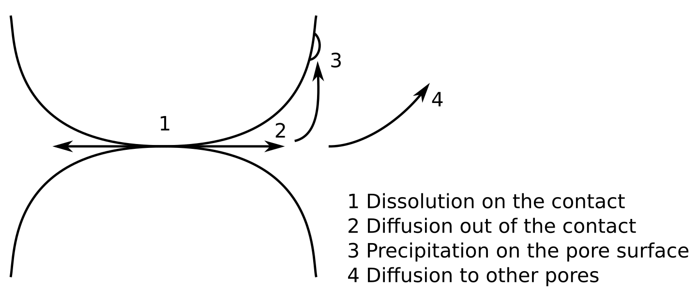

# PFDEM_ACS

Phase-Field Discrete Element Modelisation with solute generation applied to two grains.

## Simulation presentation
The goal is to simulate the pressure solution phenomena (illustrated by the following scheme) between two grains.

## Technical description
The PFDEM is a discussion between phase-field (PF) simulation and discrete element modelization (DEM). Even if those formulations are different, they can collaborate with data exchange.

The [phase-field theory](https://en.wikipedia.org/wiki/Phase-field_model) is based on the mesh of the sample and grains are represented by a phase variable (= 1 if the node is a grain, = 0 else). This formulation transmit to the DEM the shape of the grain. Hence, a grain detection algorithm is used to extract the shape from the phase field. In this case, no information about the solute is needed as it is assumed the solute is instantaneously evacuated.

The [discrete element model](https://en.wikipedia.org/wiki/Discrete_element_method) does not need mesh and grains are represented by a list of vertices (here polygonal grains are assumed). The role of the DEM is to compute the position of the grains. Then, an algorithm is used to convert the grain position in a new phase-field. The mechanical energy at the contact level is not considered as the acid is the motor term of the dissolution.

A back and forth is done between phase-field (PF) simulation and discrete element modelisation (DEM). Hence, once a steady-state is reached with the DEM, the phase-field theory is called. The shape of the grains will change and the steady state is not verified and must be computed by a new DEM step.
The following schemes illustrate the algorithm.

Phase-field approach is computed with [MOOSE](https://github.com/idaholab/moose) (the solver must be correctly installed) and DEM is computed with an own script based on python 3.9.6. The launch of this project is done by executing the python script <i>main.py</i> (multiple run can be asked with <i>multiple_main.py</i>). The user can change variables inside the python script <i>User.py</i>. A section in the following helps to understand the different inputs.

Saves are done before the phase-field simulation and at the end of the DEM. If crash (it seems to happend often during the phase-field simulation with MOOSE) occurs during the simulation, the function <i>main_after_crash.py</i> can be called to come back before the crash.

A [documentation](https://alexsacmorane.github.io/pfdem_acs) for the python script is available.

### Phase-field
The goal of the phase-field step is to compute the shape of the grains as it evolves with the precipitation/dissolution.
An Allen-Cahn formulation is used coupled with a solute generation and diffusion. Hence, the conservation of the mass should be verified as precipitation/dissolution occurs.

### DEM
The goal of the DEM step is to compute a steady-state configuration. Grains are assumed as polygonal. The shape is computed from an interpolation of the phase variable. At the end of the step, interactions (grain-grain and grain-wall) are computed to highlight the evolution of the chain force and k0.

## What is next ?
Some next releases are presented here.

- increase the user experience (homogenize names, correct english)
- create AI or a guide to select algorithm parameters (as neighborhood update frequency, time step, stop criteria, etc...)
- add some quick tests to check the script
- correct the functions P_is_inside() because if the coordinate y = the coordinate of the vertex, the point is considered outside (even  if it is not the case)
- publish an article about the simulation and result

## Understand User.py

#### Sample

- <i>x_box_min</i> : the minimum on the x axis of the sample
- <i>x_box_max</i> : the maximum on the x axis of the sample
- <i>n_x</i> : the number of nodes in the x direction
- <i>y_box_min</i> : the minimum on the y axis of the sample
- <i>y_box_max</i> : the maximum on the y axis of the sample
- <i>n_y</i> : the number of nodes in the y direction
- <i>grain_discretization_square</i> : is the discretization of the grains

#### Algorithm

- <i>np_proc</i> : number of processor used for the simulation
- <i>n_t_PFDEM</i> : the total number of PFDEM iteration. A PFDEM iteration is composed by one DEM and one phase-field simulations.
- <i>n_t_PF</i> : approximatively the time step of the phase-field simulation. It defines with <i>dt_PF</i> the total duration of the phase-field simulation
- <i>dt_PF</i> : the time step used for the phase-field simulation. This value is defined with different values. The selection of the value depend on the total absolute energy energy. Criterias to switch level are defined with <i>Ed_level</i>
- <i>c_min</i> and <i>c_max</i> : are minimum and maximum values for plotting solute concentration 
- <i>sphericity_margin</i> : is a margin (because of numerical estimation) for grain sphericity compute
- <i>n_spatial_inscribing</i> : is a precision (because of numerical estimation) for grain sphericity compute
- <i>L_flag_plot</i> : is the list of plots to do. The different options are available.
                      - <i>Config</i> : Grain et solute configuration
                      - <i>C_at_P</i> : Evolution of the solute concentration at the point (0,0), always in the contact area
                      - <i>Diff_Solute</i> : Focus on the diffusion of the solute
                      - <i>dt</i> : Evolution of the time step used during phase-field iterations. This one depend on the energy introduced in the sample
                      - <i>Sphericity</i> : Evolution of the 2D sphericity of the grains
                      - <i>Kc</i> : Diffusion map
                      - <i>Movie</i> : Movie of the different configurations
                      - <i>sum_Ed</i> : Distribution of the energy in the sample

#### Sollicitations

- <i>overlap_target</i> : overlap applied at the DEM iterations
- <i>chi</i> : chemical energy coefficient in the phase-field formulation

#### Material

- <i>width_int</i> : The width interface of the phase variable
- <i>M_pf</i> : The mobility of the phase variables
- <i>kappa_eta</i> : the gradient coefficient for the phase variables
- <i>Energy_barrier</i> : the energy barrier og the phase variables
- <i>kappa_c</i> : the gradient coefficient for the solute
- <i>method_to_compute_kc</i> : the method to compute the diffusion map. Can be <i>dilation</i> (recommended) or <i>interpolation</i>
- <i>tau_kappa_c</i> : define the interpolation in the case of interpolation method to compute the diffusion map

